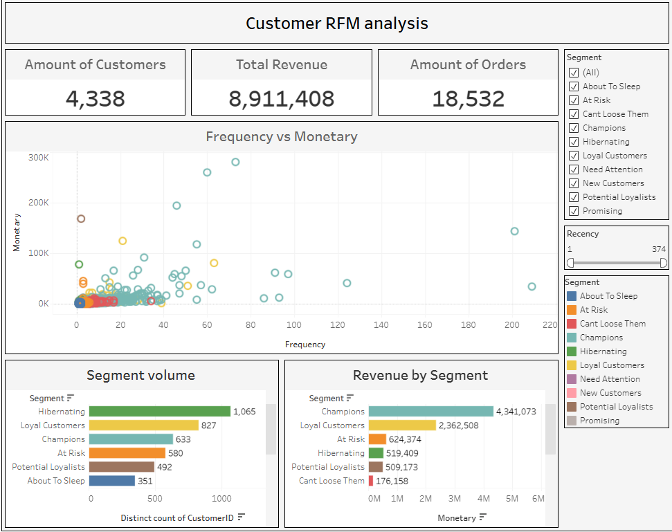
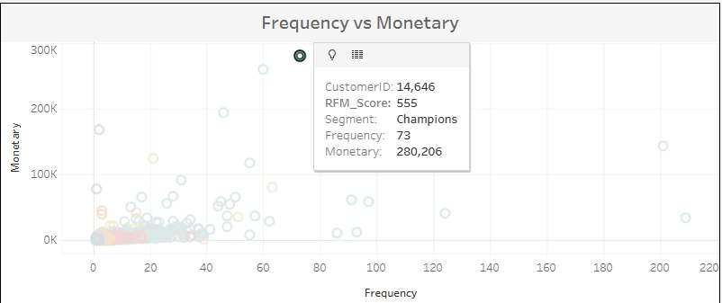
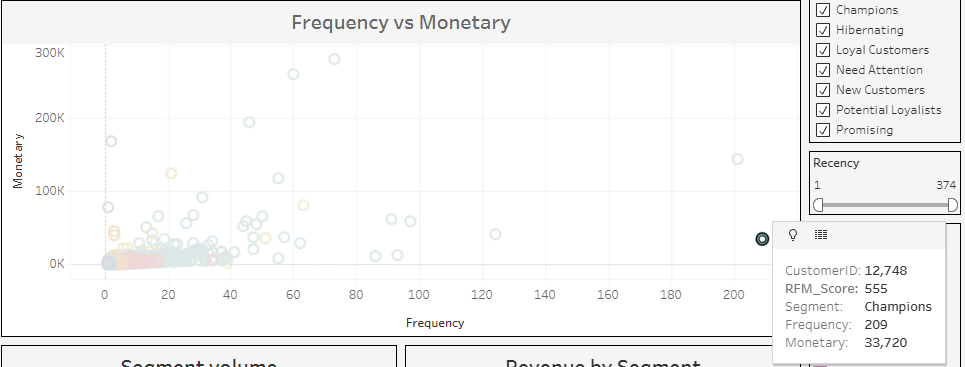

# Customer Segmentation & RFM Analysis

## Project Overview
In the highly competitive e-commerce sector, treating all customers equally leads to an inefficient allocation of the marketing budget. The goal of this project is to analyze transactional data, segment the customer base using **RFM (Recency, Frequency, Monetary) analysis**, and create an interactive dashboard. This enables the business and marketing teams to interact with different customer groups in a highly targeted manner.

## Tech Stack
* Python: Data cleaning, preprocessing, and cohort analysis. 
* Libraries: pandas, matplotlib, seaborn, squarify, datetime.
* Tableau Public: Interactive data visualization and dashboard creation.

## Process and Methodology
1. Data Cleaning & Preparation: Filtered out canceled orders, removed negative quantities and prices, and handled missing Customer IDs.
2. Cohort Analysis: Calculated the customer Retention Rate across their "lifetime" months and visualized it using a Seaborn Heatmap to identify drop-off points.
3. RFM Modeling: 
   * Calculated Recency (days since last purchase), Frequency (total number of orders), and Monetary (total spend) metrics.
   * Assigned scores from 1 to 5 using quintiles (pd.qcut).
   * Grouped customers into 10 distinct business segments (e.g., Champions, Loyal Customers, At Risk, Hibernating).
4. Data Visualization: Exported the processed data to a CSV file and used it to build an interactive Tableau dashboard with dynamic filters.

## Interactive Dashboard
!!! [View my interactive dashboard on Tableau Public](https://public.tableau.com/shared/5GBWM2QWZ?:display_count=n&:origin=viz_share_link)!!!
  

(The dashboard allows filtering data by RFM segments, analyzing revenue share, and dynamically exploring individual customer metrics).*

## Key Insights and Anomaly Detection
During the Exploratory Data Analysis (EDA) and visualization phase, specific outliers ("Whales") were identified that require immediate business attention:

**Anomaly 1: The "Hidden B2B Partner"**
  
  * **Observation:** One specific customer generated $280,000 in revenue.
  * **Business Solution:** Most likely, this is a large wholesale buyer or a B2B partner, not a standard retail customer. 
  * **Recommendation:** Assign a dedicated Key Account Manager to provide VIP support, negotiate individual terms, and retain the customer in the long term.
  
**Anomaly 2: The "Dropshipper / Bot"**
   
  * **Observation:** A single Customer ID made around 33,000 orders, but with a relatively low average order value.
  * **Business Solution:** This behavior clearly indicates a dropshipping model, an automated purchasing bot, or a technical glitch. 
  * **Recommendation:** Conduct an account audit. If it is a legitimate dropshipper, offer an official API integration or a special wholesale pricing structure.

## Strategic Business Recommendations
Based on the segmentation results, I propose the following strategies for customer base management:
1. **Champions (High RFM):** Reward them. This is the perfect audience for testing new products. Do not waste discount promo codes on them (they will buy anyway) - instead, offer exclusive early access or a special status in the loyalty program.
2. **At Risk (High spend, but dropping activity):** These are great customers who are starting to churn. Send personalized reactivation emails with significant, but time-limited discounts.
3. **Hibernating (Low RFM):** The largest segment by volume, but with minimal revenue. Do not spend an expensive advertising budget (targeted ads) on them. Use automated and low-cost email campaigns.

## Author
**Artem Shcherbinin**
(*Data Analyst*)
* [LinkedIn](https://www.linkedin.com/in/artem-shcherbinin)
* [GitHub](https://github.com/artpol1105)